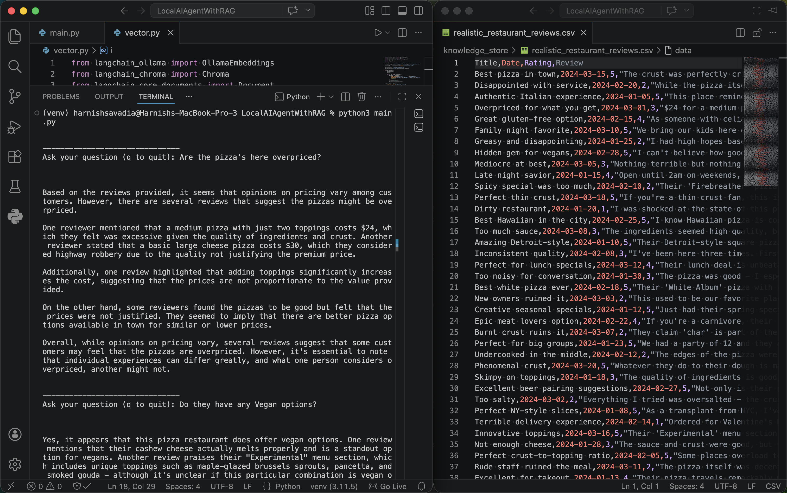

# LocalAIAgentWithRAG
## 🍕 Pizza Restaurant Review AI Agent

A local AI-powered question-answering agent that uses Retrieval-Augmented Generation (RAG) to answer questions about a pizza restaurant based on real customer reviews. Runs entirely on your machine using Ollama — no API keys or cloud services required.

---

## How It Works

1. **Embeddings** — Customer reviews are embedded using `mxbai-embed-large` via Ollama and stored in a local ChromaDB vector store.
2. **Retrieval** — When you ask a question, the top 5 most relevant reviews are retrieved using semantic similarity search.
3. **Generation** — The retrieved reviews and your question are passed to `llama3.2` (also via Ollama), which synthesizes a grounded answer.

```
Question → Retrieve relevant reviews → LLM generates answer from reviews
```

---

## Project Structure

```
├── knowledge_store/
│   └── realistic_restaurant_reviews.csv   # Review dataset
├── chrome_langchain_db/                   # Auto-generated ChromaDB vector store
├── vector.py                              # Embedding + vector store setup
├── main.py                                # Chat loop and LLM chain
├── requirements.txt
└── README.md
```

---

## Prerequisites

- [Ollama](https://ollama.com) installed and running locally
- Python 3.9+

Pull the required models before running:

```bash
ollama pull llama3.2
ollama pull mxbai-embed-large
```

---

## Setup

### 1. Clone the repository

```bash
git clone https://github.com/harnish7576/LocalAIAgentWithRAG.git
cd LocalAIAgentWithRAG
```

### 2. Create and activate a virtual environment

```bash
python -m venv venv
```

**macOS / Linux:**
```bash
source venv/bin/activate
```

**Windows:**
```bash
venv\Scripts\activate
```

### 3. Install dependencies

```bash
pip install -r requirements.txt
```

### 4. Run the agent

```bash
python main.py
```

The first run will embed all reviews and persist them to `./chrome_langchain_db`. Subsequent runs skip this step and load directly from the vector store.

---
## Demo



---

## Requirements

```
langchain
langchain-core
langchain-ollama
langchain-chroma
chromadb
posthog
numpy
pandas
```

Install all at once:

```bash
pip install -r requirements.txt
```

---

## Data Format

Reviews are loaded from a CSV file with the following schema:

| Column   | Type    | Description                  |
|----------|---------|------------------------------|
| `Title`  | string  | Short title of the review    |
| `Date`   | string  | Date of the review           |
| `Rating` | integer | Star rating (1–5)            |
| `Review` | string  | Full review text             |

---

## Tech Stack

| Component       | Tool                        |
|-----------------|-----------------------------|
| LLM             | `llama3.2` via Ollama       |
| Embeddings      | `mxbai-embed-large` via Ollama |
| Vector Store    | ChromaDB                    |
| Orchestration   | LangChain                   |
| Data            | pandas                      |

---

## Notes

- The vector store is only populated on the first run. To re-embed (e.g. after updating the CSV), delete the `chrome_langchain_db/` directory and rerun.
- All inference is local — no data leaves your machine.
- To swap the LLM or embedding model, update the model names in `main.py` and `vector.py` respectively, and pull the new models via Ollama.
